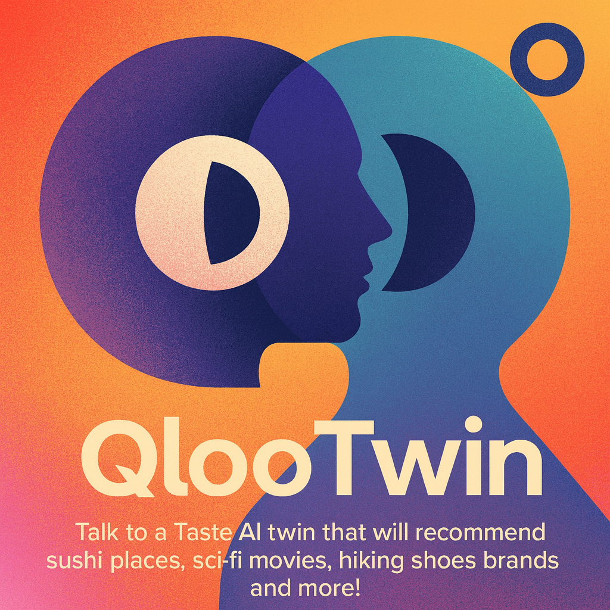
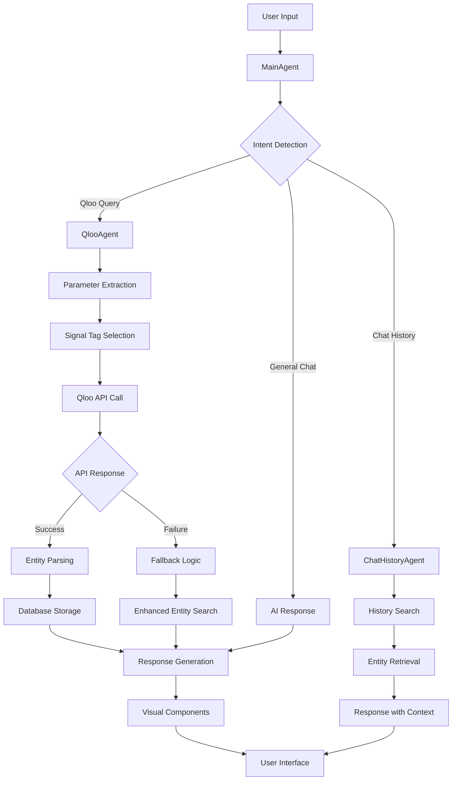

# QLooTwin - AI Cultural Intelligence Companion



QLooTwin is an AI-powered cultural intelligence companion that provides personalized recommendations across dining, entertainment, brands, travel, and lifestyle. Built with Next.js, TypeScript, and integrated with Qloo's advanced taste intelligence API.

## 🎯 Mission

QLooTwin serves as your personal AI concierge, powered by Qloo's sophisticated taste intelligence. It helps users discover personalized recommendations across 10+ curated categories, from Michelin-starred dining to hidden neighborhood gems, from indie films to luxury fashion brands.

## 🏗️ Architecture Overview

### Core Components

```
┌─────────────────────────────────────────────────────────────┐
│                    QLooTwin Application                    │
├─────────────────────────────────────────────────────────────┤
│  Frontend (Next.js + TypeScript)                          │
│  ├── ChatGPTInterface (Main UI)                           │
│  ├── PersonaSidebar (User Profiles)                      │
│  ├── VisualChatElements (Recommendation Cards)            │
│  └── EntityScorePanel (Scoring Display)                   │
├─────────────────────────────────────────────────────────────┤
│  Agent System (AI Orchestration)                          │
│  ├── MainAgent (Central Coordinator)                      │
│  ├── QlooAgent (Parameter Extraction)                     │
│  ├── PersonaManager (User Profiling)                      │
│  ├── ChatHistoryAgent (Memory Management)                 │
│  ├── SignalTagSelector (Tag Intelligence)                 │
│  └── SmartInterestExtractor (Interest Analysis)           │
├─────────────────────────────────────────────────────────────┤
│  Qloo API Integration                                     │
│  ├── getInsights (Personalized Recommendations)           │
│  ├── getEntity (Entity Search)                            │
│  ├── getTags (Tag Discovery)                              │
│  ├── searchTagsWithTolerance (Fuzzy Tag Search)          │
│  └── getTagTypes (Category Mapping)                       │
├─────────────────────────────────────────────────────────────┤
│  Database (Prisma + SQLite)                               │
│  ├── ChatSession (Conversation History)                   │
│  ├── Message (Chat Messages)                              │
│  ├── Entity (Qloo Entities)                               │
│  ├── Persona (User Profiles)                              │
│  ├── PersonalInterest (User Interests)                    │
│  └── ApiCall (API Call Logging)                           │
└─────────────────────────────────────────────────────────────┘
```

## 🤖 Agent Logic Flow



## 🔧 Key Features

### 🎭 Persona Management
- **Dynamic User Profiles**: Create and manage personalized personas with demographics, interests, and location
- **Interest Extraction**: AI-powered analysis of user conversations to automatically identify and store interests
- **Location Intelligence**: Smart location detection and updates based on user queries
- **Confidence Scoring**: Track how well the system understands each user's preferences

### 🍽️ Cultural Intelligence
- **Multi-Domain Recommendations**: Restaurants, movies, brands, travel, music, books, and more
- **Personalized Matching**: Uses Qloo's taste intelligence to match users with culturally relevant options
- **Context Awareness**: Considers user location, demographics, and historical preferences
- **Real-time Updates**: Continuously learns from user interactions

### 💬 Advanced Chat Interface
- **Transparent Design**: Beautiful glass-morphism UI with background image integration
- **Entity Visualization**: Rich cards showing recommendations with images, descriptions, and scores
- **Message Management**: Delete individual messages or start fresh conversations
- **Session Persistence**: Maintain conversation context across sessions

### 🔍 Smart Search & Discovery
- **Fuzzy Tag Matching**: Intelligent tag discovery with typo tolerance
- **Fallback Mechanisms**: Robust error handling with informative failure messages
- **Entity Resolution**: Maps user interests to Qloo entity IDs
- **Signal Optimization**: Uses multiple signals for better recommendation accuracy

## 🛠️ Technical Stack

### Frontend
- **Next.js 14**: React framework with App Router
- **TypeScript**: Type-safe development
- **Tailwind CSS**: Utility-first styling
- **Vercel AI SDK**: AI integration utilities

### Backend
- **Node.js**: Runtime environment
- **Prisma**: Database ORM
- **SQLite**: Local database storage
- **Qloo API**: Cultural intelligence data

### AI & Agents
- **Google AI**: Text generation and analysis
- **Custom Agent System**: Modular AI orchestration
- **Intent Detection**: Rule-based query classification
- **Parameter Extraction**: Smart parsing of user inputs

## 📊 Qloo API Integration

### Core Functions

| Function | Purpose | Key Features |
|----------|---------|--------------|
| `getInsights` | Personalized recommendations | Location-aware, signal-based matching |
| `getEntity` | Entity search and details | Fuzzy matching, rich metadata |
| `getTags` | Tag discovery | Category mapping, relevance scoring |
| `searchTagsWithTolerance` | Fuzzy tag search | Typo tolerance, semantic matching |
| `getTagTypes` | Category classification | Hierarchical organization |

### Data Flow
```
User Query → Parameter Extraction → Tag Selection → API Call → Entity Parsing → Response Generation
```

## 🎨 UI/UX Design Philosophy

### Visual Design
- **Transparent Elements**: Glass-morphism effect with backdrop blur
- **Background Integration**: Beautiful gradient background visible through UI elements
- **White Text Hierarchy**: Optimal contrast with varying opacity levels
- **Responsive Layout**: Three-panel design with dynamic sizing

### User Experience
- **Intuitive Navigation**: Clear session management and persona controls
- **Visual Feedback**: Loading states, error messages, and success indicators
- **Accessibility**: High contrast text and keyboard navigation support
- **Performance**: Optimized rendering and efficient state management

## 🚀 Development Story

### The Vibe Coding Journey

QLooTwin was born from a vision to create an AI companion that truly understands cultural preferences. The development journey was marked by several key phases:

#### Phase 1: Foundation (Week 1)
- **Initial Setup**: Next.js with TypeScript and Tailwind CSS
- **Basic Chat Interface**: Simple message exchange with AI responses
- **Qloo API Integration**: Basic entity search and recommendation display

#### Phase 2: Agent Architecture (Week 2)
- **Modular Design**: Implemented the agent system for better code organization
- **Intent Detection**: Rule-based classification of user queries
- **Parameter Extraction**: Smart parsing of location, entity types, and filters
- **Fallback Logic**: Robust error handling with informative messages

#### Phase 3: Persona System (Week 3)
- **User Profiles**: Dynamic persona creation and management
- **Interest Extraction**: AI-powered analysis of user conversations
- **Location Intelligence**: Smart location detection and updates
- **Database Integration**: Prisma ORM with SQLite for data persistence

#### Phase 4: UI/UX Enhancement (Week 4)
- **Transparent Design**: Beautiful glass-morphism interface
- **Visual Components**: Rich recommendation cards with images and scores
- **Message Management**: Delete functionality and session controls
- **Branding**: QLooTwin logo and consistent visual identity

#### Phase 5: Advanced Features (Week 5)
- **Chat History**: Memory tool for retrieving past conversations
- **Entity Resolution**: Mapping user interests to Qloo entities
- **Signal Optimization**: Improved recommendation accuracy
- **Performance Optimization**: Efficient rendering and state management

### Key Challenges & Solutions

#### Challenge 1: Entity Type Detection
**Problem**: Qloo API sometimes returns generic entity types (`urn:entity`) instead of specific ones
**Solution**: Implemented intelligent type inference based on entity properties and name keywords

#### Challenge 2: Message Duplication
**Problem**: Visual components and text hyperlinks were rendering duplicate entities
**Solution**: Created conditional rendering logic with priority system for visual elements

#### Challenge 3: Location Accuracy
**Problem**: Fallback API calls were losing location context
**Solution**: Added explicit location preservation in all fallback scenarios

#### Challenge 4: Text Contrast
**Problem**: Black text was invisible against the gradient background
**Solution**: Converted all text to white with appropriate opacity levels for hierarchy

## 📈 Performance Metrics

- **Response Time**: Average 2-3 seconds for Qloo API calls
- **Entity Parsing**: Handles 3-10 entities per response based on content size
- **Memory Usage**: Efficient state management with minimal re-renders
- **Database Queries**: Optimized with Prisma's query builder

## 🔮 Future Roadmap

### Planned Features
- **Multi-language Support**: Internationalization for global users
- **Advanced Analytics**: Detailed usage insights and recommendation performance
- **Social Features**: Share recommendations and discover friends' preferences
- **Mobile App**: Native iOS and Android applications
- **API Rate Limiting**: Smart caching and request optimization

### Technical Improvements
- **Real-time Updates**: WebSocket integration for live recommendations
- **Offline Mode**: Cached recommendations for offline access
- **Advanced Caching**: Redis integration for improved performance
- **Microservices**: Service decomposition for better scalability

## 🛡️ Security & Privacy

- **Data Encryption**: All sensitive data encrypted at rest
- **API Key Management**: Secure storage of Qloo API credentials
- **User Privacy**: No personal data shared with third parties
- **Session Security**: Secure session management and token handling

## 🤝 Contributing

We welcome contributions! Please see our [Contributing Guidelines](CONTRIBUTING.md) for details.

### Development Setup
```bash
git clone https://github.com/your-org/qlootwin.git
cd qlootwin
npm install
npm run dev
```

### Environment Variables
```env
QLOO_API_KEY=your_qloo_api_key
GOOGLE_AI_API_KEY=your_google_ai_key
DATABASE_URL=file:./dev.db
```

## 📄 License

This project is licensed Unlicensed.

## 🙏 Acknowledgments

- **Qloo Team**: For providing the incredible cultural intelligence API
- **Vercel**: For the amazing Next.js framework and deployment platform
- **Tailwind CSS**: For the utility-first CSS framework
- **OpenAI/Google AI**: For the powerful language models

---

**QLooTwin** - Your AI Cultural Intelligence Companion 🎯

*Built with ❤️ and lots of coffee during late-night coding sessions*
